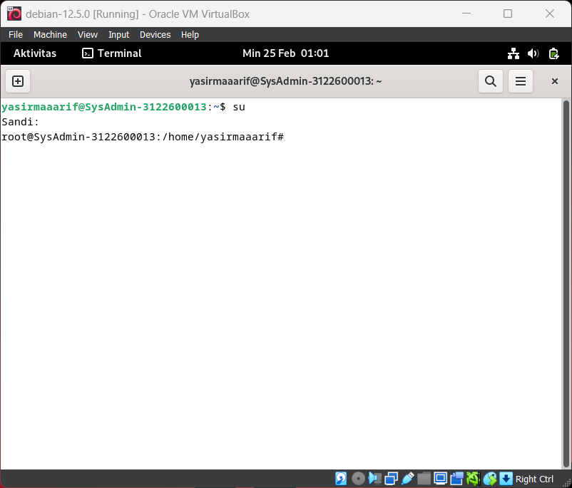
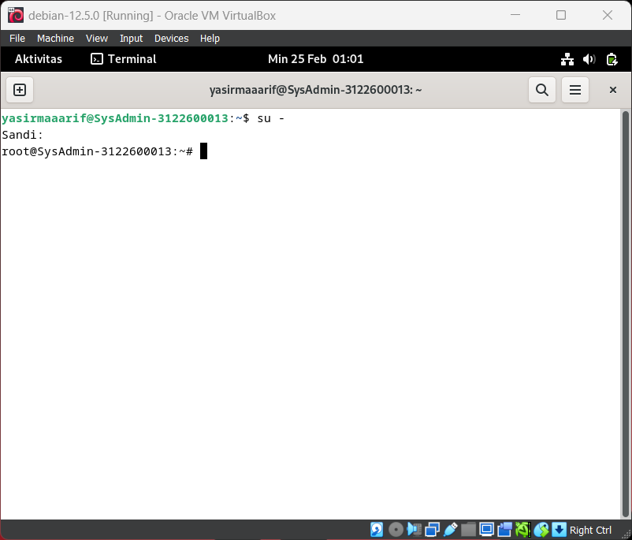

# Perbedaan su dan su -

    Nama		: Yasir Maarif
    NRP		: 3122600013
    Kelas		: 2 D4 Teknik Informatika
    Mata Kuliah	: Konsep Jaringan
    Dosen Pengampu	: Dr. Ferry Astika Saputra ST, M.Sc

#

Perbedaan antara su dan su - (atau su -l) di Debian (dan distribusi Linux lainnya) terletak pada bagaimana mereka mengganti pengguna saat menjalankan perintah. Berikut adalah penjelasan singkat tentang perbedaan keduanya:

### Perintah su:

    

Perintah su digunakan untuk beralih atau "menjadi" pengguna lain tanpa logout dari sesi shell saat ini.
Ketika Anda menjalankan su tanpa opsi tambahan, Anda akan diminta memasukkan kata sandi pengguna yang ingin Anda ganti.
su hanya mengubah identitas pengguna, tetapi tidak mengubah environment (lingkungan) atau direktori kerja.

### Perintah su - atau su -l:

    

Perintah su - atau su -l digunakan untuk beralih pengguna dan juga menduplikasi lingkungan dan direktori kerja dari pengguna yang baru.
Ini sering digunakan untuk mensimulasikan login baru sebagai pengguna yang berbeda secara lengkap, termasuk setting environment yang sama seperti saat pengguna tersebut masuk ke sistem.
Ketika Anda menjalankan su -, Anda juga akan diminta memasukkan kata sandi pengguna yang ingin Anda ganti, sama seperti su.
Lingkungan (termasuk variabel lingkungan) dan direktori kerja pengguna yang baru akan disesuaikan dengan pengguna tersebut.

Jadi, perbedaan utama antara su dan su - adalah bahwa su - melakukan lebih dari sekadar mengganti pengguna; itu juga menginisialisasi environment dan direktori kerja yang baru, menjadikannya lebih seperti sesi login baru sebagai pengguna yang berbeda.
