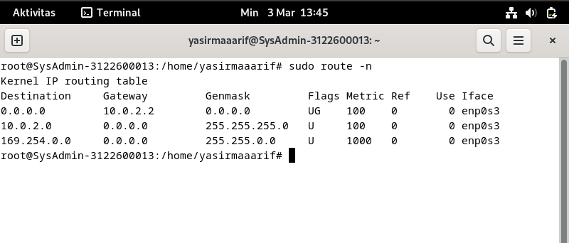

# Konfigurasi DHCP ke Manual 🛰️

    Nama		: Yasir Maarif
    NRP		: 3122600013
    Kelas		: 2 D4 Teknik Informatika
    Mata Kuliah	: Konsep Jaringan
    Dosen Pengampu	: Dr. Ferry Astika Saputra ST, M.Sc

#

### 1. Cek IP Address Awal

Untuk melakukan cek IP bisa menggunakan command `$ ip addr` pada terminal Debian. Bisa dilihat pada gambar bahwa device saya mendapatkan ip **10.0.2.15** dari DHCP.  

    

### 2. Cek IP Gateway

Selanjutnya adalah cek gateway terlebih dahulu menggunakan command `$ sudo route -n` pada terminal Debian, pastikan menggunakan user dengan privilege _root_ atau _superuser_. Alamat gateway tertera pada gambar adalah **10.0.2.2**  

    

### 3. Konfigurasi IP Manual Pada Wired Network

Konfigurasi IP Manual melalui _Wired Network_ dengan detail sebagai berikut:

<ul>
    <li>IPv4 Method: Manual</li>
    <li>Address: 10.0.2.17</li>
    <li>Netmask: 255.255.255.0</li>
    <li>Gateway: 10.0.2.0</li>
    <li>DNS: Google (8.8.8.8)</li>
</ul>

    

### 4. Cek IP Address Manual

Setelah mengkonfigurasi IP secara manual, restart _Wired Network_ lalu cek ulang menggunakan command `$ ip addr` pada terminal Debian. Bisa terlihat pada gambar bahwa IP telah berganti ke **10.0.2.17**  

    

