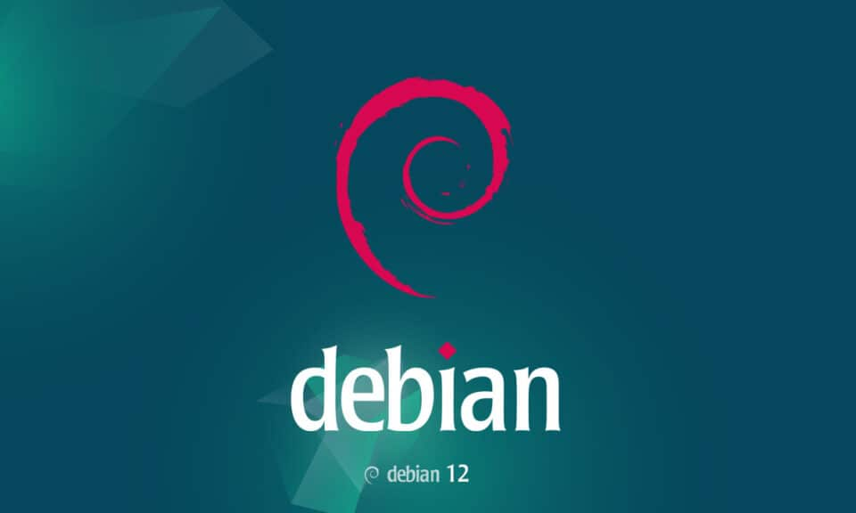

# Dasar System Administrasi

    Nama : Yasir Maarif
    NRP : 3122600013
    Kelas : 2 D4 Teknik Informatika
    Mata Kuliah : Konsep Jaringan
    Dosen Pengampu : Dr. Ferry Astika Saputra ST, M.Sc

---

---

## Dasar System Administrasi Debian 12

### Tentang Debian 12

- Debian adalah distribusi Linux yang dikenal dengan stabilitas dan kehandalannya.
- Versi terbaru, Debian 12 (nama kode: "Bookworm"), menawarkan beragam pembaruan dan peningkatan performa.

---

### Dasar-dasar Administrasi

1. **Manajemen Pengguna**

   - Debian 12 menyediakan utilitas seperti `adduser` dan `deluser` untuk manajemen pengguna.
   - Untuk menambah pengguna baru, gunakan perintah: `sudo adduser nama_pengguna`.
   - Untuk menghapus pengguna, gunakan: `sudo deluser nama_pengguna`.

2. **Manajemen Paket**
   - APT (Advanced Package Tool) adalah manajer paket yang digunakan di Debian.
   - Untuk menginstal paket baru, gunakan: `sudo apt install nama_paket`.
   - Untuk menghapus paket, gunakan: `sudo apt remove nama_paket`.

---

3. **Pembaruan Sistem**

   - Untuk memperbarui daftar paket yang tersedia, jalankan: `sudo apt update`.
   - Kemudian, untuk menginstal pembaruan yang tersedia: `sudo apt upgrade`.

4. **Manajemen Layanan**
   - Layanan sistem dikontrol menggunakan perintah `systemctl`.
   - Contoh, untuk memulai layanan: `sudo systemctl start nama_layanan`.
   - Untuk menghentikan layanan: `sudo systemctl stop nama_layanan`.

---

5. **Monitoring dan Logging**
   - Debian 12 memiliki utilitas seperti `top` untuk memantau aktivitas sistem.
   - Log sistem tersimpan di direktori `/var/log`.

---

### Kesimpulan

- Memahami dasar-dasar administrasi Debian 12 penting untuk mengelola sistem dengan efisien dan efektif.
- Dengan menguasai manajemen pengguna, paket, layanan, serta monitoring dan logging, Anda dapat menjaga sistem Debian 12 Anda berjalan dengan lancar.
