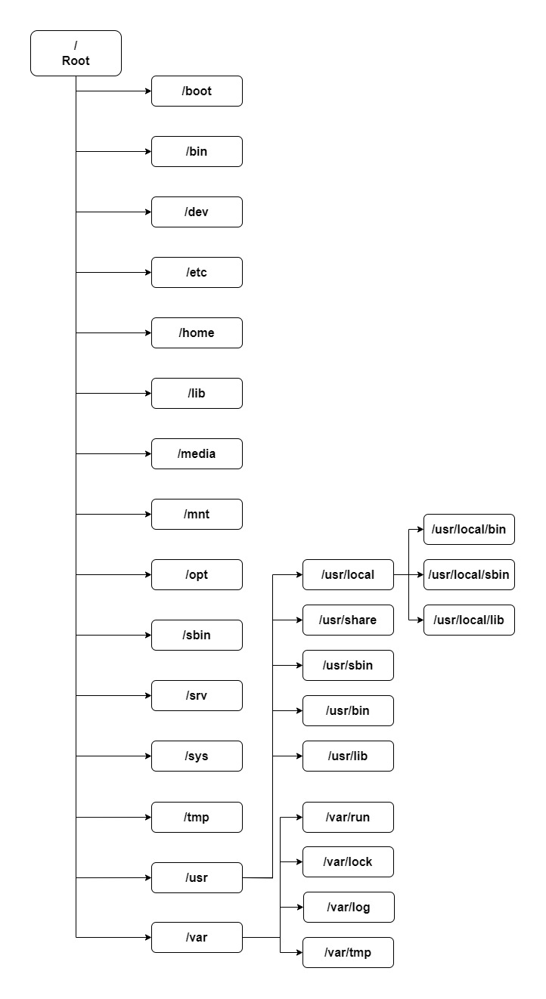

# Struktur Direktori di Debian 🛰️

    Nama		: Yasir Maarif
    NRP		: 3122600013
    Kelas		: 2 D4 Teknik Informatika
    Mata Kuliah	: Konsep Jaringan
    Dosen Pengampu	: Dr. Ferry Astika Saputra ST, M.Sc

#

    

### "/" Root

Semua struktur direktori dimulai dengan Root system file "/". Partisi dimana root akan dilokasikan pada sebuah UNIX atau UNIX-compatible system.

### /boot

Direktori /boot berisi file Boot loader termasuk Grub or Lilo, the Kernel, initrd and system.map config files

### /sys

Berisi Kernel, Firmware and system related files.

### /sbin

Berisi alat System Binaries and System Administration yang penting untuk system operation and performance

### /bin

Berisi essential binaries for users and those utilities that are required in single user mode. Examples, include cat, ls, cp etc.

### /lib

Berisi library files untuk semua binaries held in the /sbin & /bin directories

### /dev

Direktori /dev berisi system files dan drivers yang penting

### /etc

Direktori /etc berisi System configuration files including /etc/hosts, /etc/resolv.conf, nsswitch.conf, defaults and network configuration files yang penting. Ini sebagian besar adalah file konfigurasi sistem dan aplikasi khusus host

### /home

Semua direktori home pengguna disimpan di bawah direktori ini kecuali direktori home root yang disimpan di direktori /root. Direktori ini menyimpan file pengguna, pengaturan pribadi seperti .profile dll.

### /media

Titik pemasangan umum untuk media yang dapat dipindahkan seperti CD-ROM, USB, Disket, dll

### /mnt

Titik pemasangan umum untuk sistem file sementara. Ini berguna khususnya ketika memecahkan masalah dari CDROM dll dimana Anda mungkin harus memasang sistem file Root dan mengedit konfigurasi.

### /opt

Direktori yang jarang digunakan di Linux untuk Paket Perangkat Lunak Opsional. Ini banyak digunakan di OS UNIX seperti Sun Solaris di mana paket perangkat lunak diinstal

### /usr

Sub hierarki ke sistem file root yang merupakan direktori data Pengguna. Berisi utilitas dan aplikasi khusus pengguna. Anda akan kembali melihat banyak sistem file penting tetapi tidak penting yang dipasang. Di sini Anda akan kembali menemukan direktori bin, sbin & lib yang berisi biner pengguna dan sistem yang tidak penting serta perpustakaan terkait dan direktori berbagi. Juga ditemukan di sini adalah direktori include dengan file include

### /usr/sbin

Berisi biner sistem dan utilitas jaringan yang tidak penting dan tidak penting

### /usr/bin

Berisi biner perintah Non-Esensial Non-kritis untuk pengguna.

### /usr/lib

File perpustakaan untuk binari di direktori /usr/bin & /usr/sbin

### /usr/share

Direktori data bersama yang tidak bergantung pada platform

### /usr/local

Sub hierarki di bawah direktori /usr yang memiliki data spesifik Sistem Lokal termasuk biner pengguna dan sistem serta perpustakaannya

### /var

Direktori /var sebagian besar dipasang sebagai sistem file terpisah di bawah root di mana semua konten variabel seperti log, file spool untuk printer, crontab, pekerjaan, mail, proses yang berjalan, file kunci, dll. Harus hati-hati dalam merencanakan ini sistem file dan pemeliharaan karena ini dapat terisi cukup cepat dan ketika Sistem File penuh dapat menyebabkan masalah operasional sistem dan aplikasi.

### /tmp

Sistem file sementara yang menyimpan file-file sementara yang dibersihkan saat sistem di-boot ulang. Ada juga direktori /var/tmp yang juga menyimpan file-file sementara. satu-satunya perbedaan antara keduanya adalah direktori /var/tmp menyimpan file yang dilindungi saat sistem di-boot ulang. Dengan kata lain, file /var/tmp tidak dihapus saat reboot.
