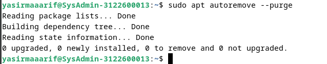
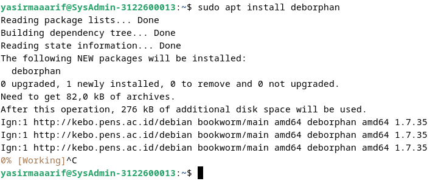
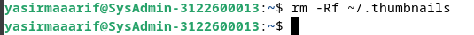

# 8.6 Cleaning the system 🔍

    Nama		: Yasir Maarif
    NRP		: 3122600013
    Kelas		: 2 D4 Teknik Informatika
    Mata Kuliah	: Konsep Jaringan
    Dosen Pengampu	: Dr. Ferry Astika Saputra ST, M.Sc

#

### 8.6.1 Disk space information

#### Command `$ df -h`

Command ini digunakan untuk **mengetahui penggunaan kapasitas disk** pada setiap _mount point_ (drive dan partisi) pada siste.  

    

#### Command `$ du` dan `$ sort`

Digunakan untuk **mengecek seberapa _bulky_ direktori** yang terdapat pada sistem dalam satuan megabyte.  

    

#### NCDU

Merupakan software _disk analyzer_ dalam mode konsol. Sebelum dapat menggunakan software ini harus menginstall terlebih dahulu dengan command `$ sudo apt update && sudo apt install ncdu` lalu ketikkan command `$ ncdu` untuk membukanya.  

    

#### Baobab

Sama seperti NCDU, bedanya Baobab merupakan GUI dan terintegrasi dengan GNOME. Instalasinya sama seperti NCDU dengan mengetikkan command `$ sudo apt update && sudo apt install baobab` lalu command `$ baobab` digunakan untuk menjalankan software tersebut.  

    

### 8.6.2 Cleaning the packages

#### Command `$ apt clean`

Command yang berfungsi untuk **membersihkan cache** dari package yang terinstall pada sistem. 

    

#### Command `$ apt autoremove --purge`

Berfungsi untuk **menghapus package beserta file confignya** dari sistem.  

    

#### Command `$ apt list ` dan `$ apt remove`

Berfungsi untuk **menghapus package obsolete** dari sistem.  

    

#### Deborphan

Selain `$ apt remove`, kita juga bisa menginstall Deborphan yang berfungsi untuk **menghapus _orphaned_ package** dari sistem.  

    

    

### 8.6.3 Emptying the trash bins

#### The User Wastebasket

Berikut command untuk membersihkan trash bin milik user.  

    

#### The Root Wastebasket

Berikut command untuk membersihkan trash bin milik user root.  

    

### 8.6.4 Purging application caches

Beberapa aplikasi menggunakan direktori cache untuk menyimpan file grafis dan beberapa informasi lainnya supaya bisa berjalan lebih cepat. Biasanya cache tidak memakan banyak ruang disk, tetapi jika direktori cache tersebut menjadi terlalu besar maka bisa dihapus untuk menyisakan ruang disk. 

#### Command

Berikut adalah command untuk menghapus file cache. 

    

### 8.6.5 Purging the thumbnails

Thumbnails merupakan representasi dari file grafis seperti gambar atau video yang disimpan pada suatu direktori untuk digunakan ulang. Hal ini dapat menimbulkan masalah ketika user menghapus suatu file grafis, dikarenakan file thumbnailsnya yang masih tersimpan dan dapat memakan ruang disk hanya untuk menyimpan file obsolete. 

#### Command

Berikut adalah command untuk menghapus file thumbnails. 

    

